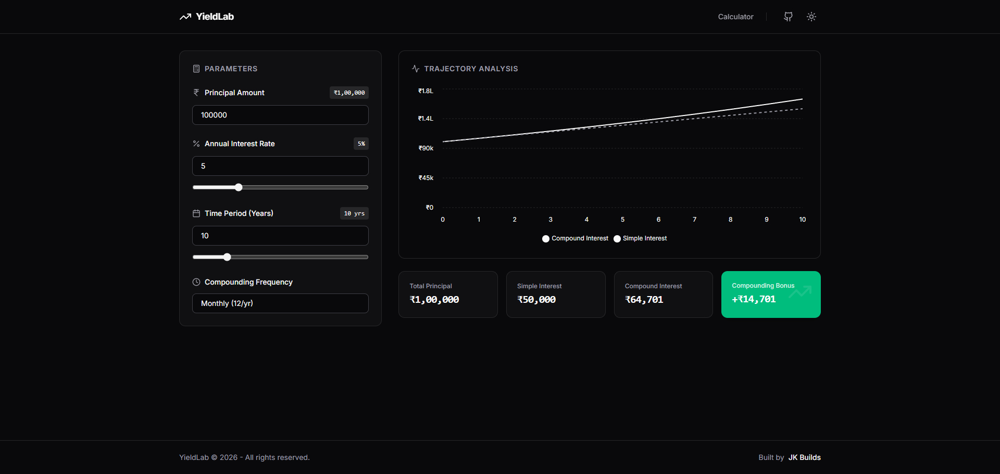

# YieldLab: Interest Trajectory Visualizer

YieldLab is a browser-side, high-performance visualization tool designed to instantly compare the growth of simple versus compound interest over time. Built with a minimalist, monochrome aesthetic, it strips away distractions to focus purely on financial data and mathematical trajectories.

## 🚀 Features

* **Interactive Visualization:** Real-time chart updates comparing simple and compound interest curves using Recharts.
* **Dynamic Calculations:** Instantly calculates total yields based on custom principal, rate, time, and compounding frequencies.
* **"Compounding Bonus" Metric:** Automatically isolates and calculates the exact financial difference between simple and compound growth.
* **Browser-Side Logic:** Zero backend dependencies. Lightning-fast performance with all state managed locally.
* **Monochrome UI:** A clean, high-contrast, professional design system built with Tailwind CSS.

## 🛠 Tech Stack

* **Core:** React, TypeScript, Vite
* **Styling:** Tailwind CSS
* **Data Visualization:** Recharts
* **Icons:** Lucide React

## 🌊 Vibe Coded

This project was entirely **vibe coded**. Built through rapid application development and high-level AI prompting, the entire frontend - from the core Recharts visualization to the React and Vite state management - was generated seamlessly. It's a testament to shipping fast and focusing on the outcome.

## 📞 Get in Touch

[Say Hi to Dev](https://links.jishantukripal.com)